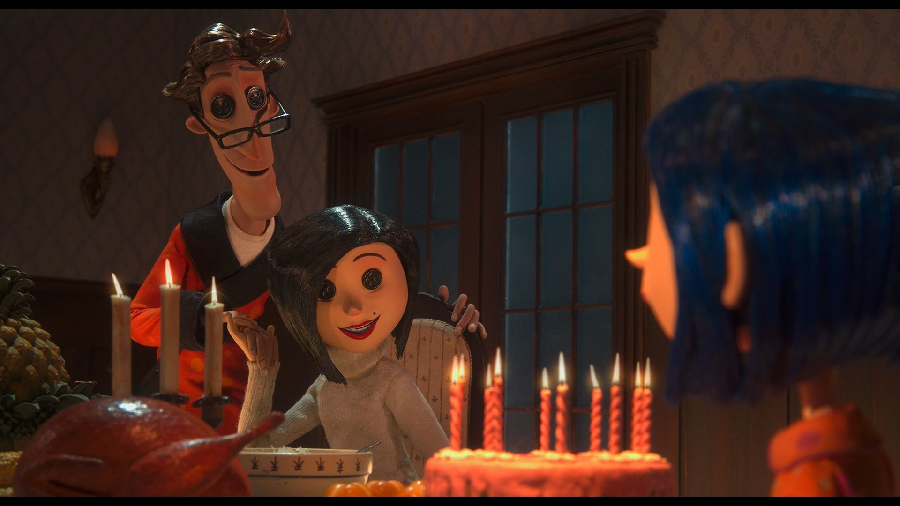
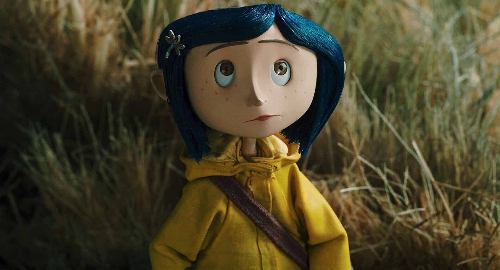

# qjia0024_9103_tut3
Artwork: Piet Mondrian 'Broadway Boogie Woogie'

Method:Time-Based:Employ timers and events for animation.

## How to interact
1.Click the “Play” button to start the background music.

2.Click “Pause” to stop the music.

3.Drag the progress bar slider to jump to a different time in the music.

4.Watch the screen: after 15 seconds, the background begins to change colors every 1.2 seconds.

##### Observe animations:

1.Squares move from left to right every 0.5 seconds.

2.Rectangles and squares rise from the bottom every second.

3.Hover over the piano keys at the bottom (14 total). The key turns red when hovered.

## My Individual Approach
#### Time
My animation is time-based which also include audio to make the animation more engaged. I focused on synchronizing visual elements with the passage of time during music playback. Instead of using mouse interaction or Perlin noise like some group members, I implemented logic that responds to:

1.music current time,

2.consistent frame intervals (every 30/60 frames),

   time-based background changes after 15 seconds..
#### What I Animate & How It's Unique

## Part 1: Imaging Technique Inspiration
>I was inspired by the frame-by-frame animation in Coraline(2009).The way the characters move in small, deliverate steps reminded me of how shapes fall,rotate and move in Tetris.I want to bring the similar feeling to my project by letting shapes shift,change or move gradually. This kind of movement works well for time-based animation because the changes unfold over time, even without any user interaction—just like in stop-motion films or classic video games.

#### The main point I want to achieve
>1.Mimic the step-by-step movement seen in stop-motion films and games like Tetris. 
2.Show gradual visual changes over time without needing user input. 
3.Make squares of the same color disappear when they connect. 
4.Let the final image, formed by all the shapes, represent the group project we create together.

## Part 2: Coding Technique Exploration
>I found that using millis() in p5.js is an effective way to control rhythmic modular transformations over time. This function tracks how much time has passed since the program started, allowing me to trigger shape changes or motion at consistent intervals. It separates animation from user input, making the system fully time-based. By using millis() to control when events happen, I can build animations that express flow, repetition, and progression in a clean and modular visual language.

-1.png)
-2.png)

#### Link of coding
1.[millis()](https://p5js.org/reference/p5/millis/) 
2.[millis()-example](https://editor.p5js.org/hafferty/sketches/rQ4zjo1sW) 

