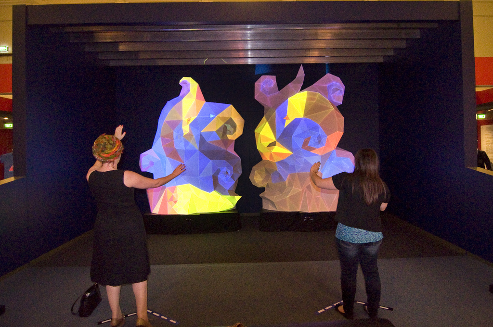
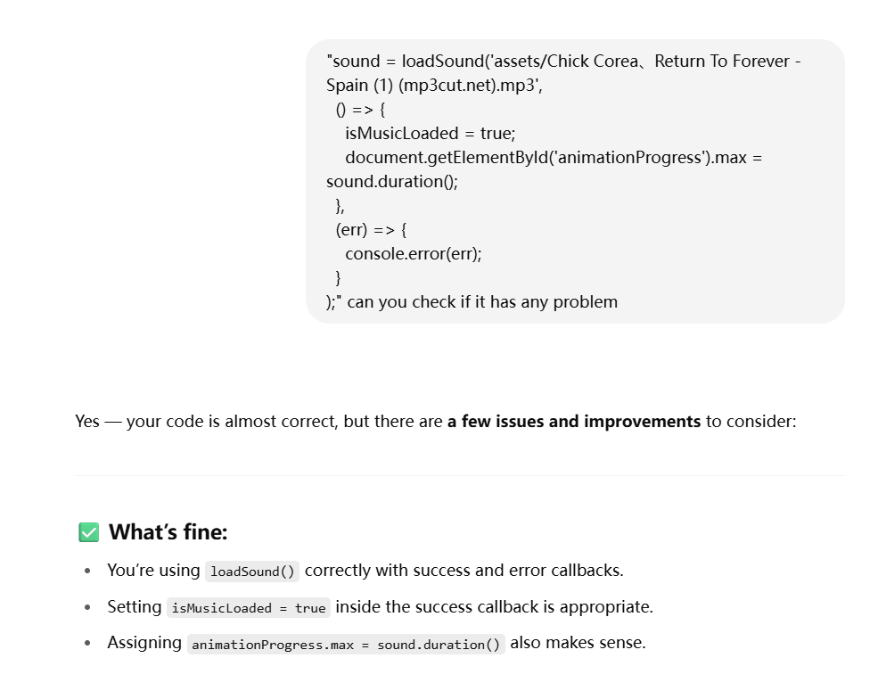
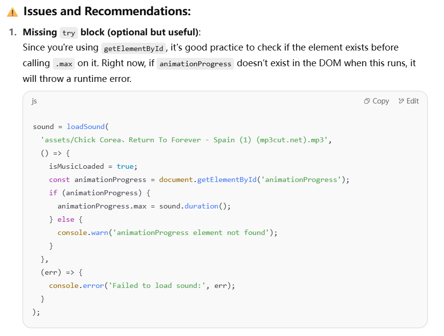

# qjia0024_9103_tut3
Artwork: Piet Mondrian 'Broadway Boogie Woogie'

Method:Time-Based:Employ timers and events for animation.

## How to interact
1.Click the “Play” button to start the background music.

2.Click “Pause” to stop the music.

3.Drag the progress bar slider to jump to a different time in the music.

4.Watch the screen: after 15 seconds, the background begins to change colors every 1.2 seconds.

##### Observe animations:

1.Squares move from left to right every 0.5 seconds.

2.Rectangles and squares rise from the bottom every second.

3.Hover over the piano keys at the bottom (14 total). The key turns red when hovered.

## My Individual Approach
#### Time
My animation is time-based which also include audio to make the animation more engaged. I focused on synchronizing visual elements with the passage of time during music playback. Instead of using mouse interaction or Perlin noise like some group members, I implemented logic that responds to:

1.music current time,

2.consistent frame intervals (every 30/60 frames),

   time-based background changes after 15 seconds..
#### What I Animate & How It's Unique
As the music plays, colorful squares appear from the left side of the canvas every 30 frames, moving horizontally across the screen. At the same time, every 60 frames, a set of vertical shapes—a yellow rectangle and a gray square—gently rise from the piano key area at the bottom of the canvas, intertwining with the horizontally moving squares to create a rich visual rhythm.

Viewers can freely adjust the music's playback position by dragging the progress bar, or control the animation using play and pause buttons. When the animation is paused, the generation of all visual elements also stops; when resumed, the rhythm of the animation continues seamlessly.

When the music reaches the 15-second mark, the background begins to shift through a series of soft pastel tones (light pink, light gray, light blue, light yellow), changing every 1.2 seconds. This rhythmic background transition corresponds with the clapping beats in the music, offering a synchronized audio-visual experience.  In contrast to my teammates, who explored randomized Perlin noise and generative square animations, my work focuses on precisely synchronizing visual elements with the timing of the music and allows user to control the process of animation.

## Part 1: Imaging Technique Inspiration
>My inspiration came from Fractured Heart, an interactive light sculpture created by Gotye and ENESS. This artwork uses rhythmic lighting changes to respond to music, creating a highly dynamic visual experience. I was deeply drawn to the strong sense of audiovisual synchronization it presented. In my own project, I aimed to bring this rhythmic quality into the visual design by using periodic background color transitions that align with the beat of the music, creating a similar sense of rhythm and immersive atmosphere.

### Technique I use for the coding
>#### Audio

loadSound(path, successCallback, errorCallback)
Loads the audio file from the specified path. You used this with error handling to ensure the music loads properly.
https://p5js.org/reference/p5/loadSound/
https://editor.p5js.org/MatthewBoden/sketches/xizLvGl-7

sound.play()
Begins audio playback when the user presses the play button.
https://stackoverflow.com/questions/57722674/p5-js-not-loading-sound

sound.pause()
Pauses the currently playing audio.

sound.setVolume(value)
Sets the audio playback volume (you set it to 0.5 for a balanced experience).

sound.isPlaying()
Returns true if the audio is currently playing.

sound.currentTime()
Returns the current playback time of the sound in seconds — used to trigger background and animation events at precise time points.
https://stackoverflow.com/questions/57722674/p5-js-not-loading-sound

sound.jump(timeInSeconds)
Moves the playback head to a specific point in the audio — used with the progress bar input.

>#### Timing and Animation
millis()
Returns the number of milliseconds since the sketch started. Used to control background color changes every 1.2s after 15s.
https://p5js.org/reference/p5/millis/
https://editor.p5js.org/schellenberg/sketches/JmzXTM1Xd

frameCount (built-in variable)
Counts the number of frames since the sketch started. Used with modulus (%) to trigger animations every 30 or 60 frames.
https://learn.newmedia.dog/tutorials/p5-js/remainder/

setTimeout() (if used for timing delays; otherwise not present)

>#### Canvas & Drawing
Creates the main drawing area.

background(color)
Sets the canvas background color. You used it dynamically based on current time and beat index.

fill(r, g, b)
Sets the color used to fill shapes.

stroke(r, g, b)
Sets the color used for shape outlines.

strokeWeight(weight)
Defines the thickness of shape outlines.

rect(x, y, w, h)
Draws rectangles and squares — your main visual elements.

ellipse(x, y, w, h)
Used in early examples (if still included) to draw circles.

noStroke()
Removes outlines from shapes.

color(r, g, b)
Creates a color object — used in your bgColors[] array and square colors.

constrain(value, min, max)
Ensures values (like X or Y positions) stay within canvas bounds (used for moving elements, if present).

>#### Interaction
createButton(label)
Creates a clickable button for controlling playback.

button.mousePressed(callback)
Attaches a click event to the button.

document.getElementById(id)
Used to access HTML elements (e.g., play/pause buttons, progress bar).

addEventListener('input', callback)
Registers an event listener on the progress bar for scrubbing through the music.

>#### Control Structures and logic
if / else if / else
Standard conditional logic used throughout your code.

for loops
Used to iterate over arrays like squares[], verticalShapes[], and to draw multiple keys.

array.push(element)
Adds new elements to squares[] and verticalShapes[].

array.splice(index, 1)
Removes elements when they move off-canvas or expire.
https://developer.mozilla.org/en-US/docs/Web/JavaScript/Reference/Global_Objects/Array/splice

array.length
Used to control loop length or limit number of items.
https://developer.mozilla.org/en-US/docs/Web/JavaScript/Reference/Global_Objects/Array/length

array[i]
Accessing specific items in arrays like squares, bgColors, verticalShapes.
https://editor.p5js.org/MatthewBoden/sketches/xizLvGl-7

## Technique Explaination
In my individual version of the code, I improved the preload() and setup() sections to support better audio control and feedback. Instead of using a basic loadSound() call like the group version, I implemented a callback-based structure that confirms whether the music has loaded successfully (isMusicLoaded = true), logs relevant messages, and updates the HTML progress slider (#animationProgress) to reflect the track's actual duration using sound.duration(). This approach improves reliability, user awareness, and ties the visual interface to the actual media state.

Additionally, I added interactive audio playback controls using getElementById() and addEventListener() for Play, Pause, and progress bar elements. Users can now start or pause playback with buttons, and even scrub to specific moments in the track using sound.jump(), enabling precise navigation. This is particularly useful when testing the time-based animations. These enhancements not only improve UI/UX but also allow smoother synchronization between visuals and music. Techniques were referenced from the https://p5js.org/search/?term=sound,https://p5js.org/reference/p5/millis/ and the community discussion - https://stackoverflow.com/questions/57722674/p5-js-not-loading-sound

## AI ACKNOWLEDGEMENT
A part of code was asked Chatgpt to help me check the problem and improve

